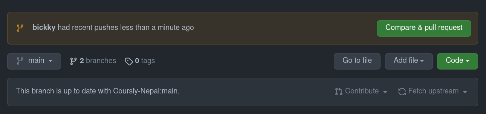
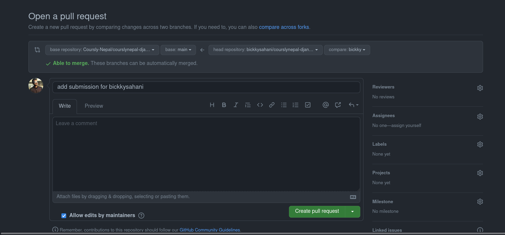
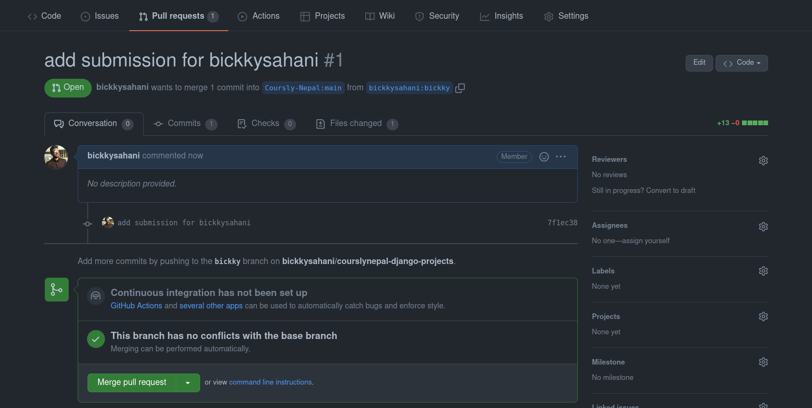

# Coursly Nepal Open Source Django Projects

## Projects
<table>
<tr>
<th>Project</th>
<th>Description</th>
<th>Language</th>
<th>Figma Link</th>
<th>HTML Templates Link</th>
</tr>
<tr>
<td>Hot Coffee Django Blog</td>
<td>Project Description</td>
<td>Python Django</td>
<td> <a href="https://www.figma.com/file/SzIUDHOPxfzoxraMNnxtib/Minimal-Blog-(challenge)?node-id=0%3A1">HotCoffee</a> </td>
<td> <a href="#">To be add soon</a> </td>
</tr>
<tr>
<td>Project 2</td>
<td>Project 2 Description</td>
<td>Python Django</td>
<td> <a href="#">Project 2</a> </td>
<td> <a href="#">Project 2</a> </td>
</tr>
</table>

## How to Submit ?
1. Fork this repository
2. Clone the repository
```
git clone https://github.com/Coursly-Nepal/courslynepal-django-projects.git
```
3. Open this repository in your favorite IDE (e.g. VSCode) and then open terminal and run the following command to create a new branch:
```
git checkout -b <branch_name>
```
4. Open submission_folder.
5. Create a new folder named as your github username.
6. Create a new README.md file in that folder.
7. Follow this template to update your README.md file.
```
# PROJECT TITLE

## Your Details
Name: user1 <br>
Email:user1@gmail.com <br>
Github Username: user1 <br>

## Project Details

Project Title: Project Title <br>
Project Description: Project Description <br>
Project Github Link: <a href="#">Project Name</a> <br>
Project Live Link: <a href="#">Project Name</a> <br>

```
8. Add, Commit and Push your changes.(from submission_folder)
```
git add .
git commit -m "add submission for user1"
git push origin <branch_name>

```
9. Open this repository in Github and Create a pull request.

Click on Compare & Pull Request.


Click on Create Pull Request.


When you create a pull request, you will be able to see your submission in the list of submissions.


10. This is the end of the submission process.
11. Wait for the admin to review your submission and merge it if it is approved.
